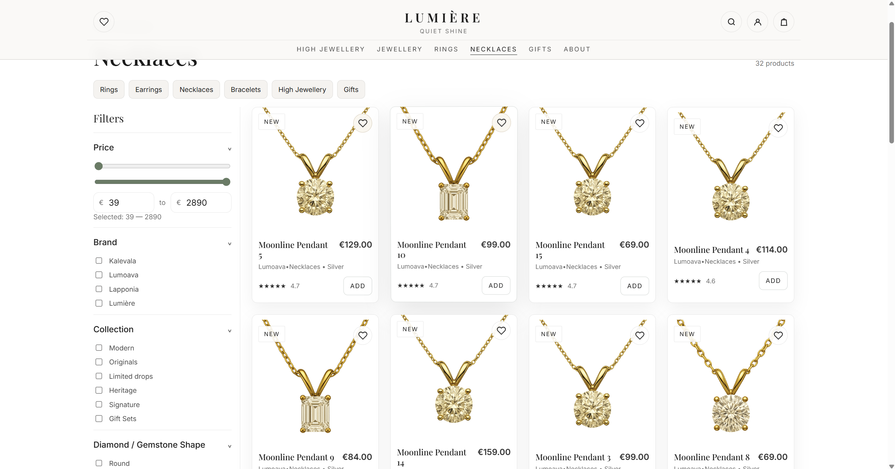
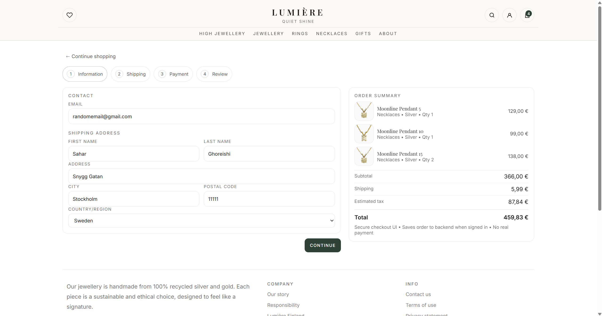
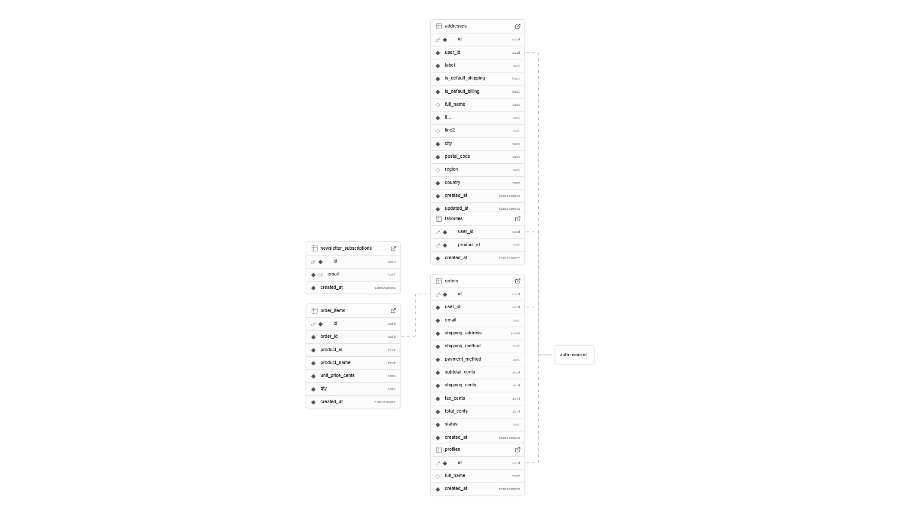
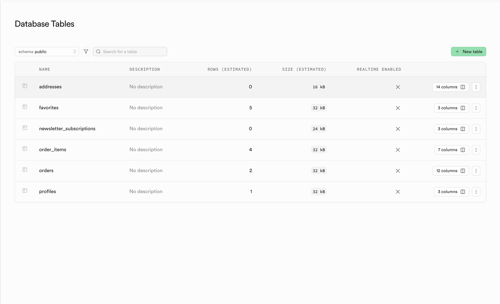

# Lumière — Luxury Jewelry E-Commerce Platform

A production-grade full-stack jewelry storefront built with a strong focus on architecture, scalability, and real-world engineering patterns. This project was designed to simulate how a modern e-commerce system is actually structured in industry, not just how it looks.

 

## Overview

Lumière is a fully functional storefront that supports product browsing, filtering, cart management, checkout flow, account data persistence, and relational database storage.  

The goal of this project was not just to build UI, but to demonstrate real engineering decisions, system thinking, and problem solving across frontend, state management, and backend integration.

 

---

## Core Features

### Product Discovery Experience

Users can browse collections, filter by attributes, and search products dynamically. The filtering system updates results instantly and is built to scale with large datasets.

**Engineering focus**
- Component-driven product cards
- Derived UI state from filters
- Query abstraction layer for backend compatibility
- Deterministic rendering for predictable updates

 

---

### Smart Filtering System

Filters are composable and independent. Price range, brand, and collection filters can be combined without conflicting state updates.

**Problem**
Filtering logic can easily become tangled when multiple filters interact.

**Solution**
Instead of mutating product lists directly, filters generate a query object. The UI renders from that query result only. This makes filtering predictable, testable, and extendable.

 

---

### Persistent Shopping Cart

Cart updates instantly, maintains quantities, and reflects totals in real time.

**Engineering Decisions**
- Centralized state store instead of prop drilling
- Immutable updates to prevent rendering bugs
- Derived totals instead of stored totals to avoid data mismatch

 

---

### Multi-Step Checkout Flow

Checkout is separated into logical stages:

1. Information
2. Shipping
3. Payment
4. Review

Each step validates its own data before allowing progression.

**Problem**
Multi-step forms often lose data or re-render unnecessarily.

**Solution**
Each step stores state independently and commits to global checkout state only after validation passes. This prevents partial state corruption.

 

---

### Order Persistence + Database Integration

Orders, addresses, favorites, and user data are stored in a relational database.

**Engineering Decisions**
- Fully normalized schema
- Explicit foreign keys
- Timestamp auditing
- Structured JSON only where flexibility was required

Why this matters:  
Most portfolio projects fake persistence. This project demonstrates actual data modeling and storage logic.

 

---

### Real Stored Data Proof

The backend is not mocked. Real rows are written when actions occur.

This confirms:

- API integration works
- Writes succeed
- Schema is correct
- Relationships are valid

 

---

## Architecture

Frontend  
- React  
- TypeScript  
- Component-driven design  
- Modular UI architecture  

Backend  
- Supabase relational database  
- Auth-ready schema  
- REST interface  

State Management  
- Central store pattern  
- Deterministic state transitions  
- Derived data instead of duplicated state  

 

---

## Key Engineering Challenges & Solutions

### Preventing State Desynchronization
Problem: cart totals and quantities drifting apart  
Solution: totals calculated from items every render instead of stored values

---

### Scaling Filter Logic
Problem: adding filters required rewriting logic  
Solution: filters generate a single query object that drives rendering

---

### Database Design
Problem: storing order data without duplication or inconsistency  
Solution: normalized schema separating orders and order_items

---

### Avoiding UI Race Conditions
Problem: async updates caused inconsistent UI states  
Solution: strict update ordering and local optimistic state

---

### Component Reusability
Problem: duplicate layout logic across pages  
Solution: composable layout primitives reused across all views

 

---

## Why This Project Is Different

Most portfolio stores demonstrate styling.

This project demonstrates engineering.

It focuses on:
- predictable state systems
- scalable architecture
- realistic data modeling
- production-style flows
- separation of concerns

The goal was to build something that could realistically evolve into a production system without needing a rewrite.

 

---

## Future Improvements

- Payment provider integration
- Admin dashboard
- Inventory system
- Server-side pagination
- Caching layer
- Order status tracking
- Email notifications
- Analytics events

The architecture already supports these without structural changes.

 

---

## Author Notes

This project was intentionally engineered with production principles in mind rather than tutorial patterns. Every architectural choice was evaluated based on scalability, maintainability, and real-world feasibility.

 

---

## Tech Stack Summary

Frontend: React + TypeScript  
Backend: Supabase  
Database: PostgreSQL (relational schema)  
State: Centralized store pattern  

 

---

## Final Thought

This is not just a UI project.  
It is a systems project disguised as a storefront.

