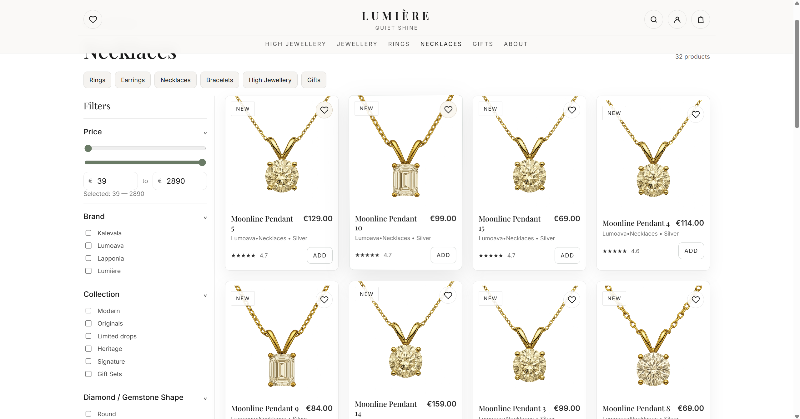
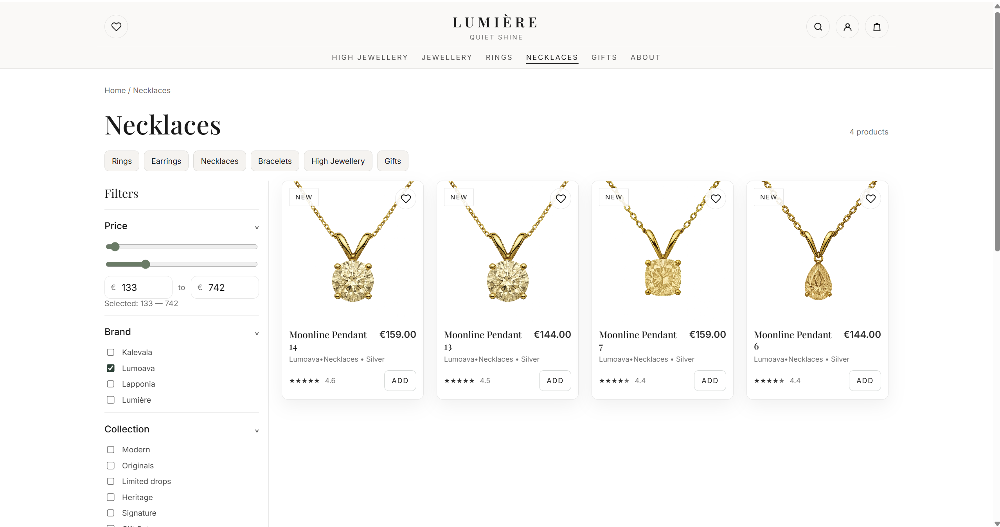
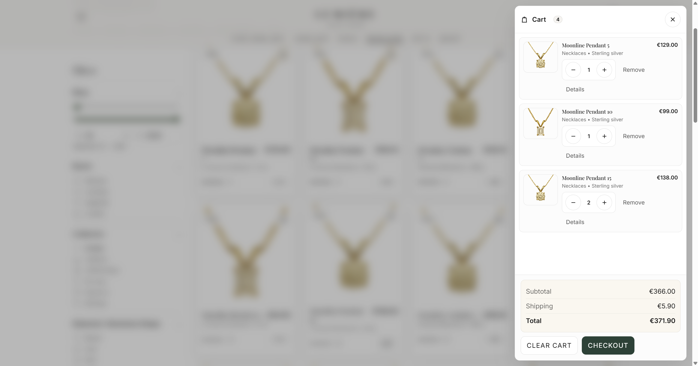
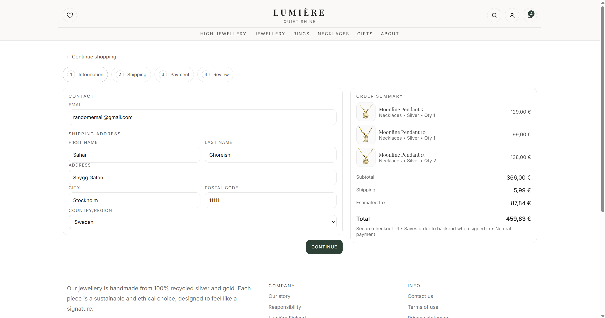

# Lumière

> A full-stack jewellery storefront that turns a polished React experience into a real application: Express APIs, MongoDB persistence, authenticated accounts, protected administration, and deliberately layered security controls.



## Why this project exists

Lumière began as a frontend-first jewellery concept. The interesting work was making it behave like a product rather than a static showcase: accounts need ownership boundaries, orders need durable records, an administrator needs a safe way to manage the catalogue, and a browser must not be trusted simply because it renders a beautiful checkout.

The result is a portfolio-scale e-commerce system with a deliberately small surface area and a practical architecture underneath.

## Product highlights

- Product discovery with text search, category views, composable filters, sorting, and pagination.
- Centralised cart and favourites state with derived totals rather than duplicated calculations.
- Account registration, sign-in, persisted sessions, profile edits, saved addresses, favourites, and order history.
- Four-step checkout that persists orders and immutable line-item snapshots.
- Newsletter subscription persistence.
- MongoDB-backed product catalogue that takes over from the local fallback catalogue as soon as managed products exist.
- A hidden, server-protected admin workspace for product CRUD and business information.







## Architecture at a glance

```text
React + Vite + TypeScript                     Express + Mongoose
Browser ── HTTPS JSON / Bearer token ──────> API ──> MongoDB Atlas
   │                                             │
   ├── central store: cart, favourites, UI        ├── users, embedded addresses/favourites
   ├── API adapter for existing client flows      ├── orders with item snapshots
   └── protected #admin workspace                 ├── products and storefront settings
                                                 └── rate limits, CORS, Helmet, auth guards
```

| Area | Implementation |
| --- | --- |
| Frontend | React 18, Vite, TypeScript, GSAP, Three.js |
| API | Express 5 with JSON REST endpoints |
| Persistence | MongoDB Atlas with Mongoose |
| Authentication | Bcrypt password hashes and signed JWT bearer sessions |
| Catalogue | MongoDB product documents with a local visual fallback catalogue |
| Administration | Email bootstrap role plus a second short-lived admin-password grant |
| Security controls | Helmet, strict CORS, request limits, NoSQL operator rejection, rate limiting, owner scoping |

## Engineering decisions that matter

### Preserve the UI while replacing the backend

The original client had several direct backend-SDK-shaped calls. Rewriting every component at once would have created a risky, hard-to-review migration. Instead, `src/lib/supabase.ts` is now a narrow compatibility adapter backed by the Express API; the legacy SDK is gone, while the existing account, checkout, favourites, and address flows retain their UI contracts.

This kept the migration incremental: backend behaviour changed without a wholesale component rewrite.

### Model data around ownership and order history

Users own their addresses and favourites. An order belongs to exactly one user and stores item name and unit-price snapshots. That snapshot is intentional: a later product rename or price update must not rewrite historical records.

Products and business settings are separate collections because they are managed by administrators and read publicly. The public catalogue returns active products only.

### Admin access has two server-side checks

The admin page is intentionally not advertised in the main navigation and is available at `/#admin`. Access requires:

1. A normal authenticated account whose email matches `ADMIN_EMAIL`.
2. A separate `ADMIN_PANEL_PASSWORD`, exchanged for a short-lived, 15-minute admin grant.

The API validates both checks before every admin route. Hiding the interface is only a UX choice; authorization remains entirely server-side.

### Security is layered, not a single middleware

The API combines Helmet headers, a narrow origin allow-list, JSON body limits, request/header timeouts, generic production errors, and IP-based rate limits. Before requests reach Mongoose, keys containing `$` or `.` are rejected to block common NoSQL operator-injection payloads.

Passwords are bcrypt-hashed at cost 12; JWTs are algorithm-pinned, issuer/audience-bound, and short-lived. Account, address, order, and admin operations are all scoped to server-resolved identity.

### The catalogue has a migration-friendly fallback

The luxury product imagery and initial browsing experience work without a database seed. On startup, the client requests `/api/products`; if managed products exist, they replace the static fallback catalogue. This allows a polished first run while making the admin-managed catalogue the production source of truth.

## Tradeoffs and next steps

| Decision | Why | Tradeoff / next step |
| --- | --- | --- |
| JWT stored by the browser | Simple REST integration during the migration | Move to Secure, HTTP-only cookies plus CSRF protection for a higher-assurance production session model |
| Compatibility API adapter | Avoided a broad frontend rewrite | Replace adapter-shaped calls with domain-specific client hooks over time |
| Static catalogue fallback | Makes local demo usable without seeding | Seed MongoDB during deployment and remove the fallback once content operations are established |
| Admin email bootstrap | Simple first-admin setup | Replace with invitation-based roles and audited role management |
| Client-calculated checkout totals | Suitable for the current order-recording demo | Before accepting payments, calculate prices, tax, stock, and shipping exclusively from server-side catalogue data |
| Application-level rate limits | Stops common abuse paths | Put the deployed API behind a CDN/WAF for volumetric DDoS protection and shared rate-limit storage |

## Problems solved along the way

- **Migrating away from a backend SDK:** preserved current UI behaviour through a small compatibility layer while routing persistence through Express and MongoDB.
- **Stale local session state:** the account icon now checks for a real API token before routing to account-only pages.
- **Admin discoverability versus security:** removed the admin link from navigation, added `/#admin` for direct access, and enforced role plus password checks at the API boundary.
- **NoSQL injection risk:** rejected operator-style request keys before ORM/database work rather than relying on route authors to remember sanitisation.
- **Port collisions in local development:** use a unique local Vite port when another application owns `5173`; the API remains at `4000` by default.
- **Updating a live catalogue:** the storefront reloads managed products from the API without sacrificing the initial visual catalogue experience.

## Repository layout

```text
src/
  components/          Storefront, account, checkout, and admin UI
  lib/                 API client and compatibility adapter
  store/               Central cart, favourites, product, and UI state
  data/                Local fallback catalogue and imagery helpers
server/
  index.js             Express API, models, auth, security, admin routes
  README.md            API-focused configuration and security notes
screenshots/           Storefront screenshots used in this README
.env.example           Local and deployment configuration template
```

## Run locally

### Prerequisites

- Node.js 20+
- A MongoDB Atlas cluster and database user

### 1. Configure the environment

```powershell
Copy-Item .env.example .env
```

Set these values in `.env`:

| Variable | Purpose |
| --- | --- |
| `MONGODB_URI` | MongoDB Atlas connection string |
| `JWT_SECRET` | Random secret of at least 32 characters |
| `ADMIN_EMAIL` | Email address allowed to unlock administration |
| `ADMIN_PANEL_PASSWORD` | Separate strong password for the admin panel |
| `CLIENT_ORIGIN` | Browser origin allowed by API CORS, e.g. `http://localhost:5173` |
| `PORT` | API port; defaults to `4000` |
| `VITE_API_URL` | Client API base URL; defaults to `http://localhost:4000/api` |

Never commit `.env` or share an Atlas password. Rotate exposed credentials before deploying.

### 2. Install and run

```powershell
npm ci
npm run dev:all
```

Open [http://127.0.0.1:5173](http://127.0.0.1:5173). If that port is occupied, launch Vite on an isolated port:

```powershell
npm run dev -- --host 127.0.0.1 --port 5180 --strictPort
```

API health check: `http://127.0.0.1:4000/api/health`

Admin workspace: `http://127.0.0.1:5173/#admin`

## API surface

| Group | Endpoints |
| --- | --- |
| Health | `GET /api/health` |
| Authentication | `POST /api/auth/register`, `POST /api/auth/login`, `GET /api/auth/me` |
| Account | `/api/account`, profile, favourites, and address routes |
| Orders | `POST /api/orders`, `POST /api/orders/:id/items` |
| Storefront | `GET /api/products`, `GET /api/settings`, `POST /api/newsletter` |
| Admin | `/api/admin/unlock`, dashboard, product CRUD, settings update |

## Verification

```powershell
node --check server/index.js
npm run build
```

The production build validates TypeScript and creates the Vite bundle. Manual smoke checks should cover account registration, sign-in, favourites, an order, and the administrator unlock flow against a configured Atlas database.

## Deploying

Deploy Express as a web service and the Vite build as a static site. Set API secrets only in the hosting provider, set `VITE_API_URL` during the static build, then set `CLIENT_ORIGIN` to the final frontend URL. Configure Atlas network access for the deployed API, not an unrestricted public address.

## Production readiness checklist

- Rotate any exposed Atlas credential and use a least-privilege database user.
- Serve both applications over HTTPS behind a CDN/WAF and configure a custom domain.
- Use a shared rate-limit store when running more than one API instance.
- Add server-side price, tax, inventory, and shipping calculation before integrating payments.
- Add automated API and browser tests for authentication, ownership checks, admin unlock, and checkout.
- Add audit logs for admin changes, structured error reporting, database backups, and monitoring.

---

Built as a focused e-commerce systems project: designed to look refined, but structured to make the engineering decisions easy to discuss in an interview.
